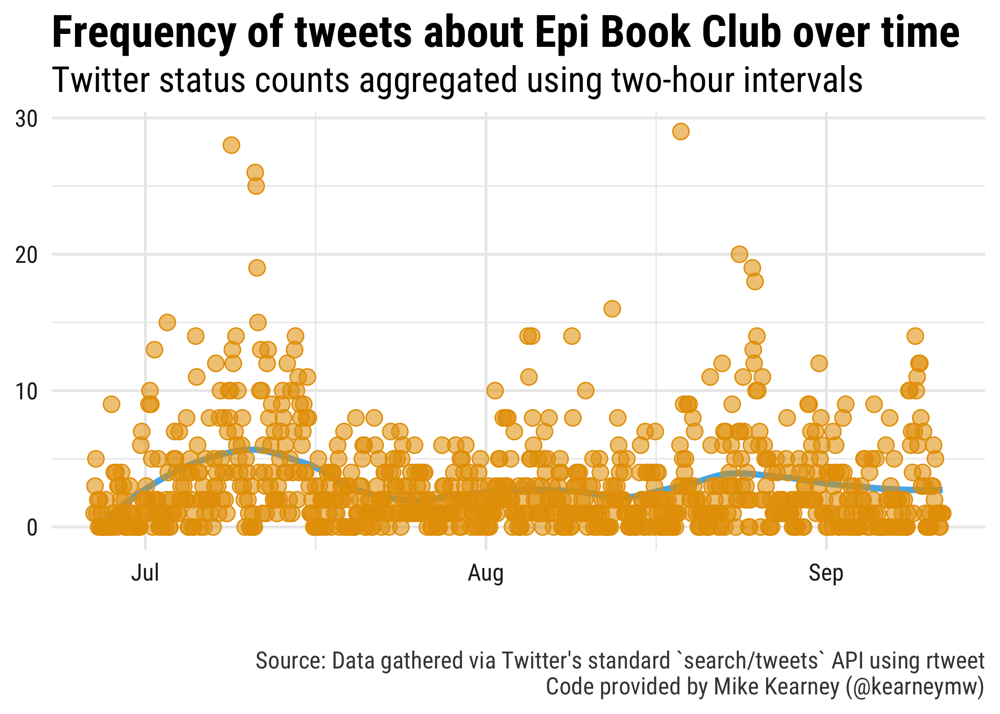
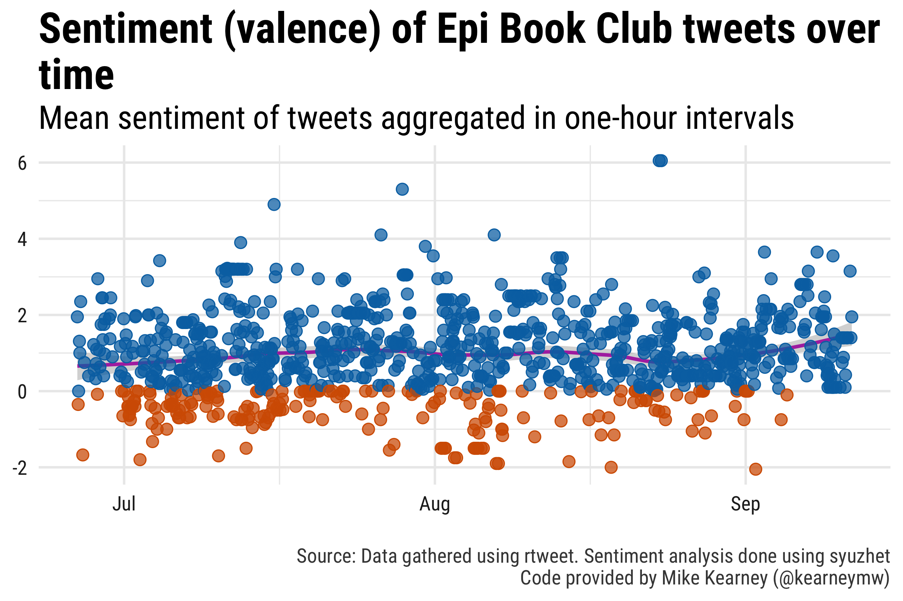
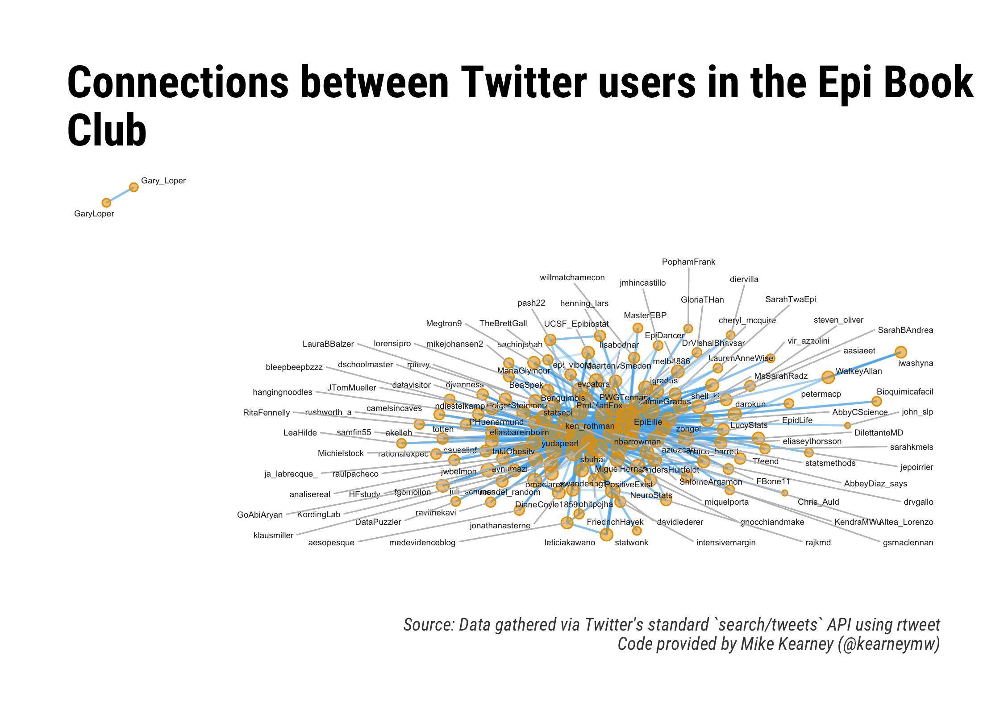
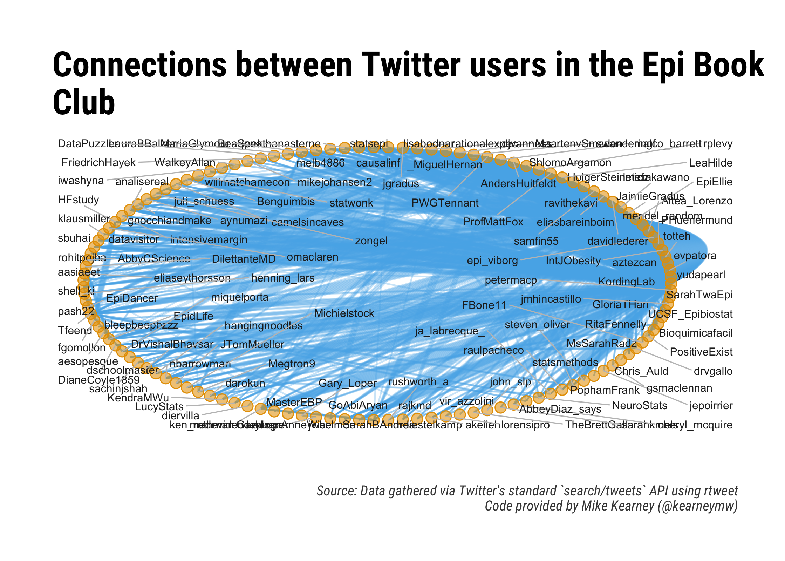

<!-- README.md is generated from README.Rmd. Please edit that file -->

# Epi Book Club tweets

This repository contains R code and data for analyzing tweets about the
Epi Book Club’s discussion of The Book of Why. The analysis is based
around the `rtweet` package, and the code is largely based on work
`rtweets` author [Mike Kearney](https://github.com/mkearney) did for
conferences, which I adapted for
[SER 2018](https://github.com/malcolmbarrett/ser_tweets). My thanks to
him for letting me use it.

Please feel free to submit PRs.

Load the data using Twitter’s search API:

``` r
library(rtweet) 

## search terms
ebc <- c("epibookclub", "bookofwhy", "thebookofwhy")

## use since_id from previous search (if exists)
if (file.exists(file.path("data", "search.rds"))) {
  since_id <- readRDS(file.path("data", "search.rds"))
  since_id <- since_id$status_id[1]
} else {
  since_id <- NULL
}

## search for up to 100,000 tweets mentioning the book club or Book of Why
rt <- search_tweets(
  paste(ebc, collapse = " OR "),
  n = 1e5, verbose = FALSE,
  since_id = since_id,
  retryonratelimit = TRUE
)

## if there's already a search data file saved, then read it in,
## drop the duplicates, and then update the `rt` data object
if (file.exists(file.path("data", "search.rds"))) {

  ## bind rows (for tweets AND users data)
  rt <- do_call_rbind(
    list(rt, readRDS(file.path("data", "search.rds"))))

  ## determine whether each observation has a unique status ID
  kp <- !duplicated(rt$status_id)

  ## only keep rows (observations) with unique status IDs
  users <- users_data(rt)[kp, ]

  ## the rows of users should correspond with the tweets
  rt <- rt[kp, ]

  ## restore as users attribute
  attr(rt, "users") <- users
}

## save the data
saveRDS(rt, file.path("data", "search.rds"))

## save shareable data (only status_ids)
saveRDS(rt[, "status_id"], file.path("data", "search-ids.rds"))
```

From there, it’s easy to plot the number of tweets about the Epi book
club over time.

``` r
library(tidyverse)

rt %>%
  filter(created_at > "2018-06-10") %>%
  ts_plot("2 hours", color = "transparent") +
  geom_smooth(method = "loess", se = FALSE, span = .4,
  size = 1.5, colour = colorblindr::palette_OkabeIto[2]) +
  geom_point(size = 3.5,
    shape = 21, col = "#E69F00", fill = "#E69F0090") +
  theme_minimal(base_size = 15, base_family = "Roboto Condensed") +
  theme(axis.text = element_text(colour = "#222222"),
    plot.title = element_text(size = rel(1.5), face = "bold"),
    plot.subtitle = element_text(size = rel(1.2)),
    plot.caption = element_text(colour = "#444444")) +
  labs(title = "Frequency of tweets about Epi Book Club over time",
    subtitle = "Twitter status counts aggregated using two-hour intervals",
    caption = "\n\nSource: Data gathered via Twitter's standard `search/tweets` API using rtweet\n Code provided by Mike Kearney (@kearneymw)",
    x = NULL, y = NULL)
```

<!-- -->

``` r

ggsave("tweets.png", dpi = 320, width = 7, height = 5)
```

Using the text of the tweets, we can also perform a sentiment analysis.

``` r
rt$text2 <- gsub(
  "^RT:?\\s{0,}|#|@\\S+|https?[[:graph:]]+", "", rt$text)
## convert to lower case
rt$text2 <- tolower(rt$text2)
## trim extra white space
rt$text2 <- gsub("^\\s{1,}|\\s{1,}$", "", rt$text2)
rt$text2 <- gsub("\\s{2,}", " ", rt$text2)

## estimate pos/neg sentiment for each tweet
rt$sentiment <- syuzhet::get_sentiment(rt$text2, "syuzhet")

## write function to round time into rounded var
round_time <- function(x, sec) {
  as.POSIXct(hms::hms(as.numeric(x) %/% sec * sec))
}

## plot by specified time interval (1-hours)
rt %>%
  mutate(time = round_time(created_at, 60 * 60)) %>%
  group_by(time) %>%
  summarise(sentiment = mean(sentiment, na.rm = TRUE)) %>%
  mutate(valence = ifelse(sentiment > 0L, "Positive", "Negative")) %>%
  ggplot(aes(x = time, y = sentiment)) +
  geom_smooth(method = "loess", span = .5,
    colour = "#aa11aadd") +
  geom_point(aes(fill = valence, color = valence), 
    shape = 21, size = 3) +
  theme_minimal(base_size = 15, base_family = "Roboto Condensed") +
  theme(legend.position = "none",
    axis.text = element_text(colour = "#222222"),
    plot.title = element_text(size = rel(1.7), face = "bold"),
    plot.subtitle = element_text(size = rel(1.3)),
    plot.caption = element_text(colour = "#444444")) +
    scale_color_manual(values = c(Positive = "#0072B2", Negative = "#D55E00")) +
    scale_fill_manual(values = c(Positive = "#0072B2BB", Negative = "#D55E00BB")) +
    labs(x = NULL, y = NULL,
    title = "Sentiment (valence) of Epi Book Club tweets over\ntime",
    subtitle = "Mean sentiment of tweets aggregated in one-hour intervals",
    caption = "\nSource: Data gathered using rtweet. Sentiment analysis done using syuzhet\n Code provided by Mike Kearney (@kearneymw)")
```

<!-- -->

``` r

ggsave("sentiment.png", dpi = 320, width = 7.5)
#> Saving 7.5 x 5 in image
```

Finally, we can plot the network of Twitter users talking about the Epi
Book Club

``` r
library(tidygraph)
#> 
#> Attaching package: 'tidygraph'
#> The following object is masked from 'package:stats':
#> 
#>     filter
library(ggraph)

## unlist observations into long-form data frame
unlist_df <- function(...) {
  dots <- lapply(list(...), unlist)
  tibble::as_tibble(dots)
}

## iterate by row
row_dfs <- lapply(
  seq_len(nrow(rt)), function(i)
    unlist_df(from_screen_name = rt$screen_name[i],
      reply = rt$reply_to_screen_name[i],
      mention = rt$mentions_screen_name[i],
      quote = rt$quoted_screen_name[i],
      retweet = rt$retweet_screen_name[i])
)

## bind rows, gather (to long), convert to matrix, and filter out NAs
rdf <- dplyr::bind_rows(row_dfs)
rdf <- tidyr::gather(rdf, interaction_type, to_screen_name, -from_screen_name)
mat <- as.matrix(rdf[, -2])
mat <- mat[apply(mat, 1, function(i) !any(is.na(i))), ]

## get rid of self references
mat <- mat[mat[, 1] != mat[, 2], ]

## filter out users who don't appear in RHS at least 3 times
apps1 <- table(mat[, 1])
apps1 <- apps1[apps1 > 1L]
apps2 <- table(mat[, 2])
apps2 <- apps2[apps2 > 1L]
apps <- names(apps1)[names(apps1) %in% names(apps2)]
mat <- mat[mat[, 1] %in% apps & mat[, 2] %in% apps, ]

## create graph object
g <- igraph::graph_from_edgelist(mat)

## calculate size attribute (and transform to fit)
matcols <- factor(c(mat[, 1], mat[, 2]), levels = names(igraph::V(g)))
size <- table(screen_name = matcols)
size <- (log(size) + sqrt(size)) / 3

## reorder freq table
size <- size[match(names(size), names(igraph::V(g)))]

twitter_graph <- as_tbl_graph(g) %>% 
  activate(nodes) %>% 
  left_join(tibble::enframe(size) %>% mutate(value = as.numeric(value)), by = "name") 

twitter_graph %>% 
  create_layout("nicely") %>% 
  ggraph() +     
  geom_edge_fan(edge_alpha = .3, spread = 3, 
                edge_colour = colorblindr::palette_OkabeIto[2]) + 
    geom_node_point(aes(size = value),
      shape = 21, 
      col = "#E69F00", 
      fill = "#E69F0090", 
      show.legend = FALSE) + 
    geom_node_text(aes(label = name), 
                   col = "#222222", 
                   repel = TRUE,
                   size = 1.5, 
                   segment.colour = "grey75",
                   segment.size = .35) + 
    theme_graph(base_size = 15, base_family = "Roboto Condensed") + 
  theme(plot.title = element_text(size = rel(1.5), face = "bold", margin = margin(3, 1, 10, 1)),
      plot.subtitle = element_text(size = rel(1.2)),
      plot.caption = element_text(colour = "#444444")) +
  labs(title = "Connections between Twitter users in the Epi Book\nClub",
    caption = "\n\nSource: Data gathered via Twitter's standard `search/tweets` API using rtweet\n Code provided by Mike Kearney (@kearneymw)",
    x = NULL, y = NULL)
```

<!-- -->

``` r

ggsave("tweet_network.png", dpi = 320, width = 8, height = 6)

twitter_graph %>% 
  create_layout("circle") %>% 
  ggraph() +     
  geom_edge_fan(edge_alpha = .3, spread = 3, 
                edge_colour = colorblindr::palette_OkabeIto[2]) + 
    geom_node_point(size = 3,
      shape = 21, 
      col = "#E69F00", 
      fill = "#E69F0090", 
      show.legend = FALSE) + 
    geom_node_text(aes(label = name), 
                   col = "#222222", 
                   repel = TRUE,
                   size = 2.5, 
                   segment.colour = "grey75",
                   segment.size = .35) + 
    theme_graph(base_size = 15, base_family = "Roboto Condensed") + 
  theme(plot.title = element_text(size = rel(1.5), face = "bold", margin = margin(3, 1, 10, 1)),
      plot.subtitle = element_text(size = rel(1.2)),
      plot.caption = element_text(colour = "#444444")) +
  labs(title = "Connections between Twitter users in the Epi Book\nClub",
    caption = "\n\nSource: Data gathered via Twitter's standard `search/tweets` API using rtweet\n Code provided by Mike Kearney (@kearneymw)",
    x = NULL, y = NULL)
```

<!-- -->

``` r

ggsave("tweet_network_circle.png", dpi = 320, width = 8, height = 6)
```
